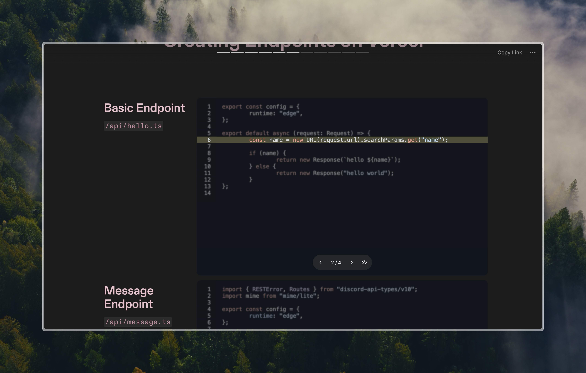

# Code Block Embed

Display interactive code blocks in your presentations, or wherever you can embed a webpage. View this example [Tome](https://tome.app/alexander/code-block-embed-clxtjhwu000gykagfr3imz6pa).

https://github.com/alexanderl19/code-block-embed/assets/41758627/df408a45-3b33-42b3-8e1b-f891085d4c51

## Guide

Currently, there is no GUI for creating an embed link, but crafting the URL by hand shouldn't be difficult.

## URL Syntax

The following options should be added as [search parameters](https://developer.mozilla.org/en-US/docs/Web/API/URLSearchParams) to the base URL (`https://code-block-embed.alexanderliu.dev/embed`)

Example: `https://code-block-embed.alexanderliu.dev/embed?code=https://raw.githubusercontent.com/...&lines=1,2,3,4,5:6,7,8,9,10`

### `code`

Type: `URL` | **Required**

A URL that serves a raw text file (MIME type: text/plain).

> [!TIP]
> If you're using a GitHub (Gist), be sure to click the "Raw" button before copying the link.

### `fontSize`

Type: `number` | Default: 16

Font size in CSS pixels.

### `lines`

Type: `0,1,2,...,10:...:1,2,3`

Groups of lines are be separated with a colon (`:`).

Each group of lines is a comma separated list of numbers.

Line numbers are zero indexed (0 corresponds to line 1).

#### Examples

| Group(s)                   | Search Param                  |
| -------------------------- | ----------------------------- |
| Lines 1-5                  | `lines=0,1,2,3,4`             |
| Lines 1-5, Lines 6-10      | `lines=0,1,2,3,4:5,6,7,8,9`   |
| Lines 1-5 + 10, Lines 6-10 | `lines=0,1,2,3,4,9:5,6,7,8,9` |

### `showOnHover`

`"true"`, or `"false"` | Default: true

Enabling will unblur non-highlighted lines while hovering on the site.

### wrapLines

`"1"`, or `"0"` | Default: 1

Enabling will wrap lines that exceed the width of the page.

## Roadmap

[x] GUI Configurator
[ ] Theme Options

## Project Goals

Maintaining a **stable** and simple solution for embedding code blocks and walkthroughs is the primary goal of this project. Any changes in existing functionality or appearance will be considered a breaking change. In other words, any valid URL today will remain functionally and visibly constant.

However, while the configurator is still being actively developed, GUI defaults may change. This does not affect the stability of generated links!

## License

Copyright © 2024 Alexander Liu

MIT License
